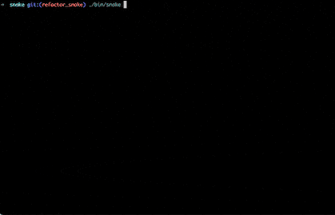

# Terminal Game Center
Some typical game implement in a terminal with C++. I'm developing this in macOS Big Sur, you maybe need to do some change if you use other system.

## Snake

### Preview

## Bounce
base on Understanding Unix/Linux Programming.

### Preview

## Tetris

### Process
under developing

## Dependencies

* make
* cpplint
* ncurses
* clang-format

## Contribution Guideline
[here](https://github.com/superxcgm/terminal_game_center/wiki/Contribution-Guideline)
