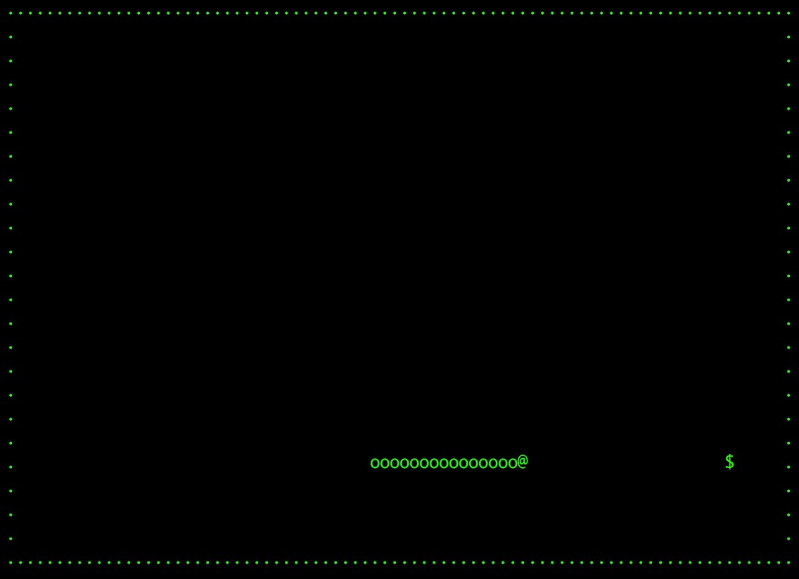

# snake
A typical game, UI and experience reference `nsnake`.
## Preview

## Feature
* Use linklist to store veer point.
* Use interval timer to redraw snake repeatedly.

## Todo List
* score

## Usage
1. make
2. ./snake
